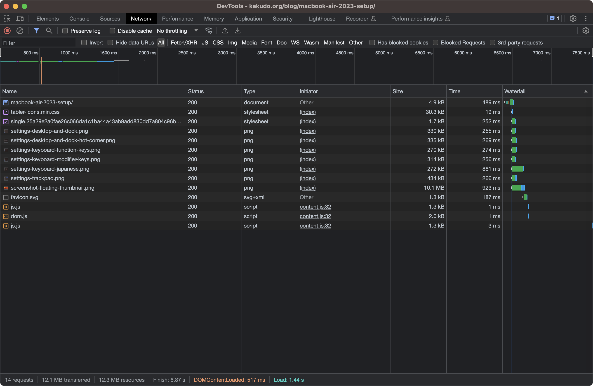
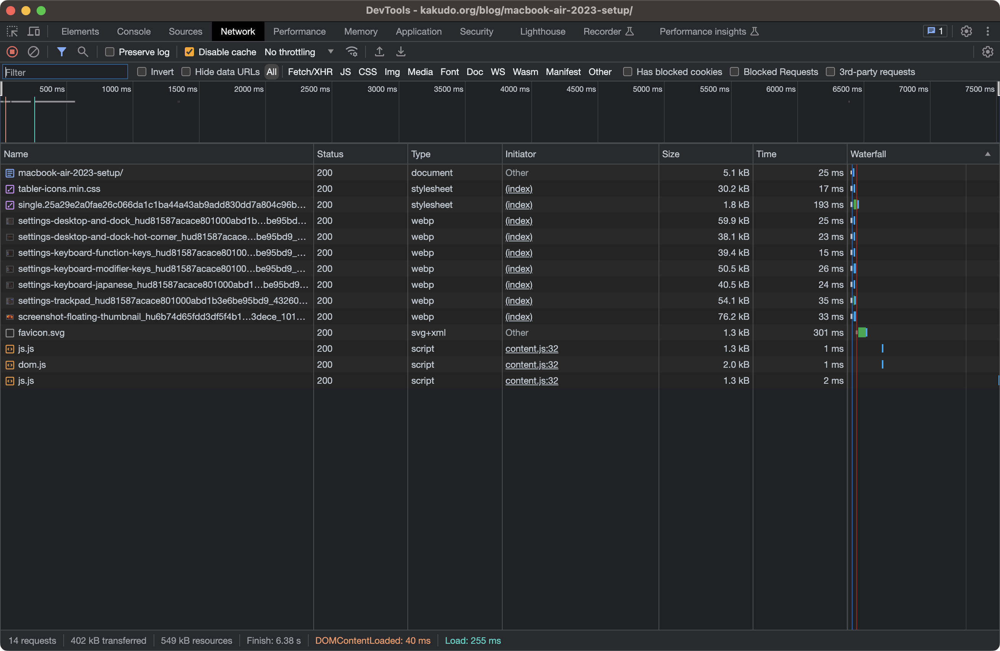

Markdown Render Hooksを使うと、Markdownレンダラである[Goldmark](https://github.com/yuin/goldmark)の挙動を上書きすることができます。
これによって、記事のソースファイルにShortcodeを入れたりせずに（つまりHugo無しに意味が通る状態で）``タグを差し替えられます。

また、Hugoには組み込みの画像圧縮機能があり、PNGなどの大きな画像ファイルをWebPといった軽量フォーマットに変換してくれます。
これらを組み合わせることで、記事の執筆環境を変えずにページの大幅な軽量化が実現できましたので共有します。

## Image Processing

Hugoでは`Resize`メソッドを利用することで、サイズ変更 ･ フォーマット変換が行えます。

構文は次の通りで、横幅 ･ 高さを`x`区切り、その後変換先フォーマットを記述します。

```
{{ $image.Resize "WIDTHxHEIGHT FORMAT" }}
```

## Markdown Render Hooks

Render Hookを登録するには、`layouts/_default/_markup/`内に対応するファイルを入れる必要があります。

画像のレンダリングを上書きする場合は、`layouts/_default/_markup/render-image.html`です。

このファイル内では次の変数を使うことができます。

| 変数名        | 内容                                        |
| ------------- | ------------------------------------------- |
| `Page`        | レンダリングされるPageオブジェクト          |
| `Destination` | 画像のURL                                   |
| `Title`       | `title`属性                                 |
| `Text`        | `alt`属性（ALTテキスト） ･ HTML             |
| `PlainText`   | `alt`属性（ALTテキスト） ･ プレーンテキスト |

たとえば、このようなMarkdownがあったとすると、

```markdown

```

各変数の値は以下のようになります。

| 変数名        | 内容                                |
| ------------- | ----------------------------------- |
| `Page`        | （書かれているPageオブジェクト）    |
| `Destination` | `"beautiful.png"`                   |
| `Title`       | `"秀逸な題名"`                      |
| `Text`        | `"とても<strong>美しい</strong>絵"` |
| `PlainText`   | `"とても美しい絵"`                  |

## 画像をimgタグからpictureタグに差し替える

以上の内容を組み合わせたHookがこちらです。

```html
{{ $sourceImage := .Page.Resources.GetMatch .Destination }}
{{ $webpImage := $sourceImage.Resize (printf "%dx%d webp" $sourceImage.Width $sourceImage.Height) }}
<picture>
  <source srcset="{{ $webpImage.RelPermalink }}" type="image/webp">
  
</picture>
```

まず、URL(`.Destination`)を利用して、`.Page`から画像オブジェクトを取得し、`.Resize`によってWebP形式に圧縮します。
その後、対応ブラウザで優先的にWebP形式の画像が呼ばれるように`<picture>`タグを配置しています。

## どれくらい通信量を減らせたか

| 圧縮前                            | 圧縮後                           |
| --------------------------------- | -------------------------------- |
|  |  |
| 12.1MB                            | 402kB                            |

（字が小さすぎて何のこっちゃですが）同じページを読み込むときの転送量が30分の1にまで小さくなりました！
元の画像が大きすぎたのを加味しても、容量が小さくなりすぎていて驚きました。キャッシュは無効にしてあります。

## 参考文献

- [Image Processing | Hugo](https://gohugo.io/content-management/image-processing/)
- [Markdown Render Hooks | Hugo](https://gohugo.io/templates/render-hooks/)
- [&lt;picture&gt;: The Picture element - HTML: HyperText Markup Language | MDN](https://developer.mozilla.org/en-US/docs/Web/HTML/Element/picture)
- [これが完全版！レスポンシブ対応のwebp画像を実装するHTMLのコード | コリス](https://coliss.com/articles/build-websites/operation/work/how-to-use-webp-images-in-html.html)