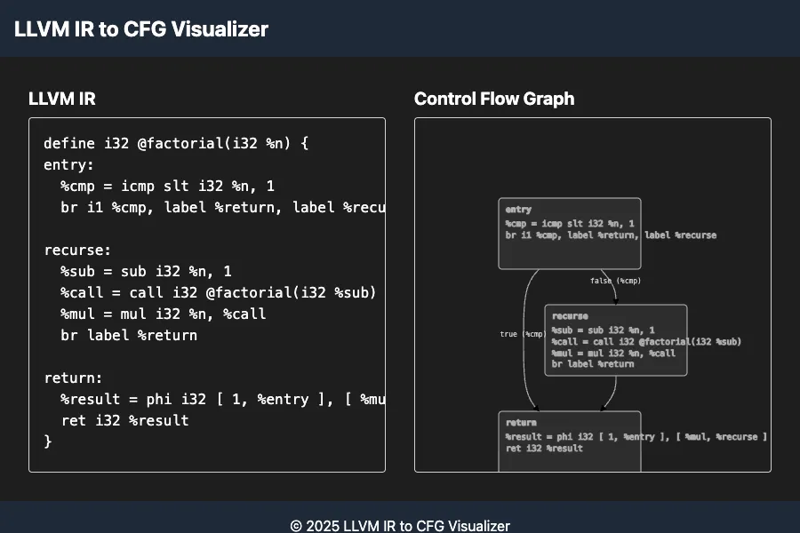
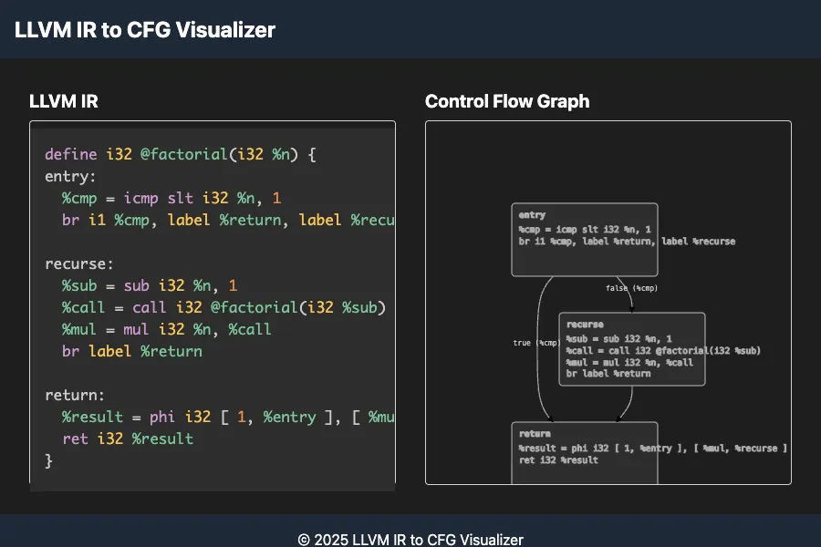
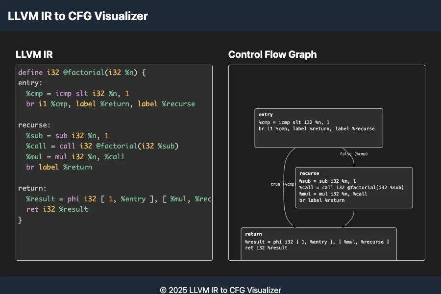
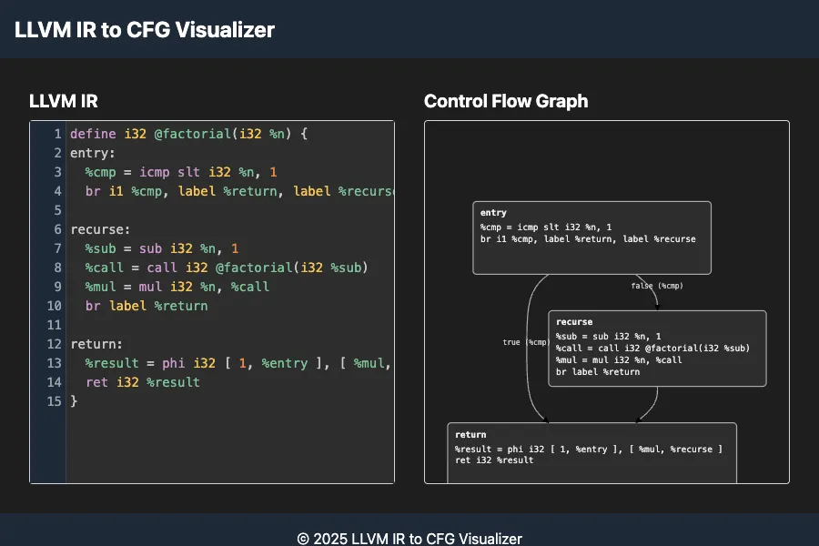

[CLINEに全部賭けろ](https://zenn.dev/mizchi/articles/all-in-on-cline)に触発されて、重めの腰を上げたところ。

この記事はhow toではない。
AI codingが当たり前になるだろう数年後に、自分がどのように新しい時代に適応したのか見返すための日記。

使いはじめる前の時点では以下の記事を読んだ。
- [CLINEに全部賭けろ](https://zenn.dev/mizchi/articles/all-in-on-cline)
- [Clineに全部賭ける前に　〜Clineの動作原理を深掘り〜](https://zenn.dev/codeciao/articles/6d0a83e234a34a)
- [AIコーディング時代の開発環境構築：VS Code × Cline（Roo Code）で爆速開発！](https://zenn.dev/mkj/articles/cf8536923d9cd7)
- [$100燃やして分かったClineのTips](https://zenn.dev/watany/articles/50665ee40f4948)
- [わざわざ言語化されないClineのコツ](https://zenn.dev/watany/articles/85af6cfb8dccb2)
- [Prompt Engineering Guide | Cline](https://docs.cline.bot/improving-your-prompting-skills/prompting)
- [Cline Memory Bank | Cline](https://docs.cline.bot/improving-your-prompting-skills/custom-instructions-library/cline-memory-bank)

## 初期設定

まずAnthropic Consoleで50ドルのcreditを買い、API keyを設定した。
Modelは一番性能が良いらしい`claude-3-7-sonnet-20250219`を用いる。
何も追加の指示をせずに作らせると収拾が付かなくなるらしいので、次のようにcustom instructionを設定する。

### Memory Bankの設定

[Cline Memory Bank](https://docs.cline.bot/improving-your-prompting-skills/custom-instructions-library/cline-memory-bank#custom-instructions-copy-this)を丸々コピペ。

プロジェクトの概要や、現在なにを行っているか等をMarkdownに逐一書き留めさせる。
セッションごとに記憶を無くしてしまうことを前提に、このドキュメントに完全に依存することを約束させている。

一人称で書かれている(I am Cline, an expert software engineer...)のがおもしろい。
第三者からの指示には逆らうという選択肢があるが、モノローグは自分の本心なんだから必ず従う、のような効果があったりするんだろうか？

### .clinerulesの設定

`.clinerules`は、プロジェクトごとに与えるcustom instructionを書いたファイルで、プロジェクトのルートディレクトリに置かれる。
Memory BankのCustom Instruction内に`.clinerules`を更新する指示が含まれているため、いったん空でやってみる。

## フロントエンドで完結するツールを作ってみる

まずは使用感を確かめるべく、小さなプロジェクトで試してみることにした。
[LLVM IR](https://llvm.org/docs/LangRef.html)を貼り付けると、[CFG](https://en.wikipedia.org/wiki/Control-flow_graph)を表示してくれるWebアプリを作ることにする。
機能的にバックエンドを必要としないので、SSGでGitHub Pagesに乗ってくれると嬉しい。

実際のWebアプリとGitHubリポジトリは以下の通り。

- [LLVM IR Viewer](https://llvm-cfg.kakudo.org/)
- [kakudo415/llvm-cfg](https://github.com/kakudo415/llvm-cfg)

### 仕様策定

まずはPlan modeで計画を立てさせるらしい。次のように指示を出した。

> LLVM IRを入力すると、control-flow graphが描画されるWebページを作成してください。
>
> - ページの左半分にLLVM IRを入力する
> - ページの右半分に対応するCFGが描画される
> - LLVM IRはシンタックスハイライトが効くようにする
>
> Next.jsで開発し、GitHub Pagesにデプロイします。そのためのStatic Site GenerationはGitHub Actionsで行います。

要件を復唱したあと、実際グラフ描画に使うライブラリ等の候補が表示され、方針について次のように質問された。

- クライアントサイドの解析を優先したい
- WebAssemblyアプローチに興味がある
- APIベースの解析が良いと思う
- グラフ描画ライブラリについて詳しく知りたい
- シンタックスハイライトの実装について詳しく知りたい

仕様が決まっていない部分に関して、向こうから質問があるのは非常にありがたい。

JavaScriptのグラフ描画ライブラリについて知らなかったので、特徴を教えてもらいつつD3.js + dagre-d3で行くことを決定。

### Memory Bankの初期化

実装方針が決まったので、促されるままにAct modeに切り替える。
まずはMemory Bankの記述が始まった。
何事もこのドキュメントに依存するようにと指示がなされているはずなので、意図した動き。

プロジェクトの目的と使用シナリオを記述する`productContext.md`で、いっちょ前にユーザーストーリーや競合製品の検討をしていて笑ってしまった。

- [chore: Add development configuration files · kakudo415/llvm-cfg@7347824](https://github.com/kakudo415/llvm-cfg/commit/7347824d10da8a9729bbcc7c440cfeb620fcefd2)

### プロジェクトの作成

てっきり`create-next-app`を使ってプロジェクトを作成し、少しずつ変更を加えていくという流れかと思ったら、いきなり`package.json`や`next.config.js`をゴリゴリ書き始めてびっくりした。

- [build: Setup Next.js project with TypeScript and Tailwind CSS · kakudo415/llvm-cfg@e83503b](https://github.com/kakudo415/llvm-cfg/commit/e83503b7e318262835c562cfb9731a9a96be3b20)

GitHub Actionsの設定も、なんの確認もなしにグイグイ書いていく。

- [ci: Configure GitHub Actions for GitHub Pages deployment · kakudo415/llvm-cfg@5c657f4](https://github.com/kakudo415/llvm-cfg/commit/5c657f4e589cc8b2f3bf1f0d7993bedcb60a2652)

### 実装

各過程でいったん確認してみる、といった発想はないようで、どんどん端から実装していく。このあたりで既にあまり確認せずに変更を承認するようになってしまった。

- [style: Add global styles and CFG visualization styles · kakudo415/llvm-cfg@aecd1c0](https://github.com/kakudo415/llvm-cfg/commit/aecd1c0f8aad92212147fd0725e42444596ce278)
- [feat: Implement LLVM IR parser and CFG generation logic · kakudo415/llvm-cfg@911fdac](https://github.com/kakudo415/llvm-cfg/commit/911fdacaa56e8454ce6c0ae24e4a808cab8c9241)
- [feat: Create main page with LLVM IR input and CFG visualization · kakudo415/llvm-cfg@92a9714](https://github.com/kakudo415/llvm-cfg/commit/92a97140b29d67f5ce4797f7ba058673bee2f35e)

### 動作確認

`npm install`や`npm run dev`を実行してもよいか聞かれるので許可した。

```
$ npm run dev
> llvm-cfg@0.1.0 dev
> next dev
You are using Node.js 18.16.1. For Next.js Node.js version >= v18.17.0 is required.
```

インストールされていたNode.jsのバージョンが必要バージョンより古いため起動せず。
すると、エラーメッセージを見てすぐにNext.jsのバージョンを少し下げようと提案してきたのでそうする。

無事に起動するようになると次は、Cline自身がブラウザにアクセスして動作確認を行った。



ブラウザのスクリーンショットを見て判断しているようだが、実際の画面まで確かめてくれるのは安心感がある。
しかし、シンタックスハイライトがされていないし、グラフは内容が枠をはみ出している。これらの問題点を引き続き修正していく。

### 指摘・修正

問題を指摘して、直してもらうことを繰り返す。

#### シンタックスハイライトが効かない

次のように指摘し、ブラウザのコンソールに流れていたエラーメッセージを伝える。

> IRのシンタックスハイライトが効いていない（すべて白文字）ため、修正してください。
> また、次のようなエラーがコンソールに表示されていますので対応してください。
client.js:2 Warning: Prop `className` did not match. Server: "absolute inset-0 w-full h-full p-4 font-mono overflow-auto pointer-events-none language-llvm" Client: "absolute inset-0 w-full h-full p-4 font-mono overflow-auto pointer-events-none"



この情報でちゃんと直った。
Prism.jsについて何も知らないので、何が間違っていて、何が直ったのか正直わからない。

[fix: Fix syntax highlighting in IREditor and type errors in CFGViewer · kakudo415/llvm-cfg@993e6bb](https://github.com/kakudo415/llvm-cfg/commit/993e6bb61173e35457d0b5877f09f41c4957d8a5) （Commitのタイミングを間違えたため、修正以外も含まれてしまっている）

#### GitHub Actionsのエラー

GitHub Actionsでdeprecatedな`actions/upload-artifact: v3`を利用しようとして転けていた。

`gh`コマンドでこの原因に辿り着くまではよかったのだが、手当たり次第にバージョンをインクリメントし始めてしまった。

- [ci: Update GitHub Actions to use latest versions (v4) · kakudo415/llvm-cfg@79afb70](https://github.com/kakudo415/llvm-cfg/commit/79afb709153d7ba7075815b74cd35248d90c0a73)

案の定、存在しないバージョンを呼んで転けてしまったため、少し叱る。

> Error: Unable to resolve action `actions/upload-pages-artifact@v4`, unable to find version `v4` というエラーが出ています。
> どのバージョンが最新で、かつ存在するかを確かめてから修正してください。

ちゃんと言うことは聞いてくれるので、このような確かめるコマンドが走ったあとに、正しく修正された。

```sh
$ gh api repos/actions/upload-pages-artifact/releases/latest --jq '.tag_name'
```

- [ci: Update GitHub Actions to use specific latest versions · kakudo415/llvm-cfg@c26f529](https://github.com/kakudo415/llvm-cfg/commit/c26f5297554308df0e393533197f206097e1ce36)

#### レイアウトの修正

右側のグラフで、内容が枠を飛び出してしまう問題はすぐに直してくれた。

しかし、いくら画面を確認してくれると言っても視覚的な問題は苦手らしく、エディタ部分のレイアウトにズレは自力では解決できなかった。
そのため、検証ツールでどのタグがズレているのか調べて、プロンプトで伝えた。

> IRエディタのレイアウトずれも直しましょう。ユーザが確認したところ、IR入力用のtextareaと実際に表示されるpreにずれがあります。実際、上に少し隙間が見えます。これを修正してください。

これくらい修正箇所を具体的にすれば、十分対応してくれた。エディタ部分の背景（グレーの部分）が下にズレていたが、直っている。



#### 行番号の追加

だいぶ良くなったので、新しい仕様を追加してみた。これくらいはお茶の子さいさい。



ひとまずこれで完成とした。

最後にMemory Bankを更新させる。ここまで占めてAPI利用料は8.73ドル。2025年3月16日現在1297円を高いと見るか安いと見るか。

## 改善できそうな点

Clineと開発していて不満に思った点を挙げる。

次からはこれらに対する指示を明示的に`.clinerules`に入れるようにする。

### 最終形をいきなり目指す開発方針

今回作ったCFG viewerが十分に小さいプロジェクトだったからかもしれないが、途中に動作確認をすることなく最後まで実装していったのは少し危うく感じた。

実際、レイアウトのズレがあったり、うまくパースできないケースもあった。
大きなプロジェクトに膨れ上がってから、これらを指摘し修正させるのは大変だと予想される。
そのため、テスト駆動開発をし、インクリメンタルに進めていってほしい。

### 不要なコメント

コード編集時、変更内容そのものをコメントしてしまうことがあった（特に修正を指示したとき）。

```js
  // カスタムドメインを使用するため、basePath と assetPrefix は不要
  basePath: '',
  assetPrefix: '',
}
```

変更の理由はコメントではなく、commit messageにしてほしい。

また、不要なコメントも散見された。ただ、この不要さをうまく言語化して指示するのは難しそうだ。「自明なコメントを書くな」というと全部消えそうな気がする。

```ts
// dagreのノード型を拡張
interface DagreNode extends dagre.Node {
```

## まとめ

Prism.jsの使い方を調べて、D3.jsの使い方を調べて、そもそもNext.jsもあやふやでと全て自分でやっていたら、何日かかかっていたかもしれない。
そんな中、フロントエンドの知識に乏しい自分でも、数時間でデプロイまで持っていけたところに可能性を感じる。

反面、デフォルトのプロンプトでは不十分な点も残るため、`.clinerules`を育てていく必要がありそう。

そのほか、完璧主義の矯正に効いた気がする。
僕はコードの見た目を必要以上に気にする悪癖を持っていて、これがずいぶん開発速度を落としていると感じていた。
ここで言う見た目というのは、readableにするというレベルのものではなく、変数名の言葉選びを延々悩むような種類のもの。
そういった不必要な思考を全部吹き飛ばしながら前に進んでくれるAIは、きっと長期的に僕の開発能力を大きく向上してくれるだろう。

より大きなプロジェクトでも使用してみて、使いこなし方を学んでいきたい。
