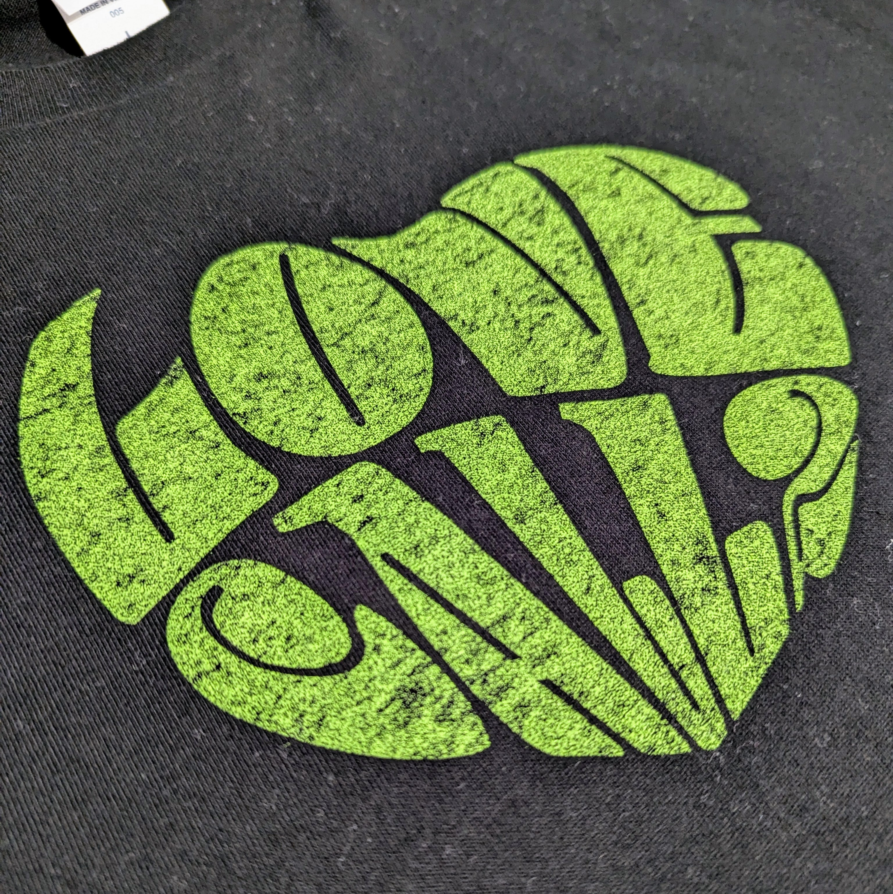

2024年7月17日、AIMYON vs TOUR 2024 “ラブ・コール2” vs. sumikaに行ってきた！！！
まだ興奮冷めやらぬままだけど、ライブの思い出を忘れないように日記のつもりで書く。

実は、もともと参加予定じゃなくてチケットリセールでゲットした今日の席。
正直キャンセルされた席だし端っこかと思っていたけど、2階ながら正面近くでよく見えたので本当によかった。

写真は当日買ったTシャツ。
あいみょん・sumikaともに物販に長蛇の列ができていて、sumika物販の列は会場前に幾重にも、あいみょん物販の列に至っては会場の[東京ガーデンシアター](https://www.shopping-sumitomo-rd.com/tokyo_garden_theater/)を取り囲まん勢いだった。
それを15分でさばくんだからイベントスタッフさんの練度はすごい。

## sumika

まずはセットリストから。
[おぶじぇさんの投稿](https://x.com/objet_rock/status/1813522124209861018)を参考にしました。ありがとうございます。

1. Lovers
2. Starting Over
3. 1.2.3..4.5.6
4. マイリッチサマーブルース

5. 初恋が泣いている
6. ふっかつのじゅもん
7. MAGIC
8. Babel

9. Summer Vacation
10. 卒業

11. 「伝言歌」
12. 運命

予習しているときからライブ映えしそうな曲ばっかりだ～と思っていたけど、間違いなかった。
初っ端から『Lovers』の「ねぇ！」で会場が一瞬で暖まり、そこからずっと手を前後に振ってるかタオル回してるかという感じ。

『卒業』がいい曲すぎて、これでライブ終わるのかと思った。

### MC

歌中心であんまりしゃべらないタイプ（と感じてしまうくらいあいみょんがしゃべり倒した）。

アーティストが「大切な人を思い浮かべて聞いてください」と言っても、95%の人はアーティストを見てて思い浮かべてなんかいないよね、って話をしていた。

## あいみょん

こっちは記憶を頼りに書いているので、間違っていたらご指摘ください。

1. ジェニファー
2. 桜が降る夜は

MC 1

3. 愛を伝えたいだとか
4. 満月の夜なら
5. ノット・オーケー

MC 2

6. マリーゴールド
7.  愛の花
8.  会いに行くのに

MC 3

9.  朝陽
10. 貴方解剖純愛歌 〜死ね〜
11. 夢追いベンガル

MC 4

12. GOOD NIGHT BABY

『ジェニファー』も『桜が降る夜は』も好きなあいみょんの曲ランキング上位なので、生で聞けて幸せだった。

『愛の花』で歌詞がちょっぴり逆に（「歪んだ空が雲を 雲を濁して」）なっていて、これが"家出"か～と謎の感動。

さらに、『夢追いベンガル』では、なんと会場に降りてきてくれた！･･･のを2階から指をくわえて眺めていたので、次のライブこそは1階を当てるぞと決意を新たにした。

### MC

あいみょんのライブは初めてだったけど、めっちゃしゃべるし気さくな関西のお姉さんって感じですごい親近感。
観客にも積極的に絡んでいたので、いつか当てはまるお題が出たら思いっきり天高く手を挙げたいところ。

覚えている範囲でMCの内容はこんな感じ。

#### MC 1

「愛する人を思い浮かべて歌います」ってアーティストが言ったら、私のことを想って歌ってよ！ってメンヘラ化しちゃうけどな。

#### MC 2

誰と来た～？

お母さんと来た人～？✋
お父さんと来た人～？✋
女の子友達と来た人～？✋
男兄弟で来た人～？✋

#### MC 3

平成生まれ～？✋
昭和生まれ～？✋

そのうち令和生まれのコギャルが侵略してくるね。
健康に気を付けようね。最近Tarzanしか読んでない。

タオル回すのいいな～。

#### MC 4

今度はsumikaが呼んでくれたりして～！

### バンドメンバー

あいみょんのサポートリードギターはqurosawaだけだと思い込んでたけど、もうひとりいらっしゃった！
なんなら『桜が降る夜は』や『マリーゴールド』のリードギターをしてたから、この人の方が目立っていたかもしれない。

メディア系のツアーレポが出たら、是非お名前を確認したい。（メンバー紹介が聞き取れなかった･･･。）

## 最後に

ドルフィン・アパートが今から楽しみ。

YouTube Musicでプレイリストを作ったので、今夜はこれを聞きながら寝る。

[ラブ・コール2 vs. sumika](https://music.youtube.com/playlist?list=PLycapkeQodvug4sQSSz4dB2cT180w4Bc8)
