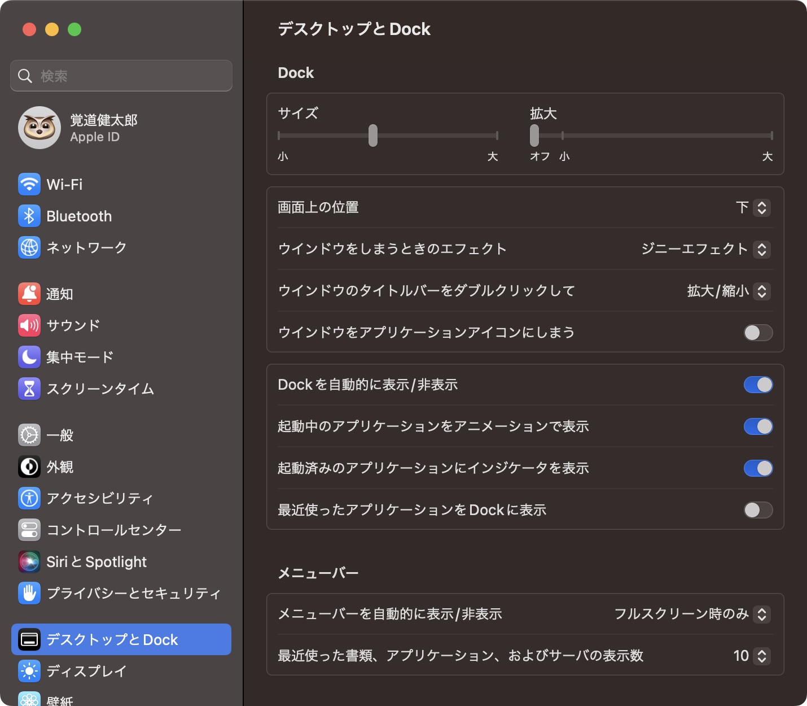
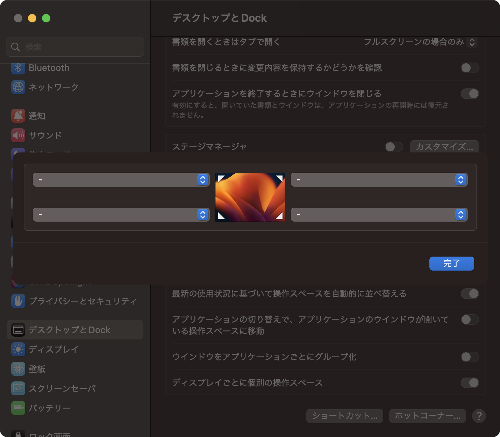
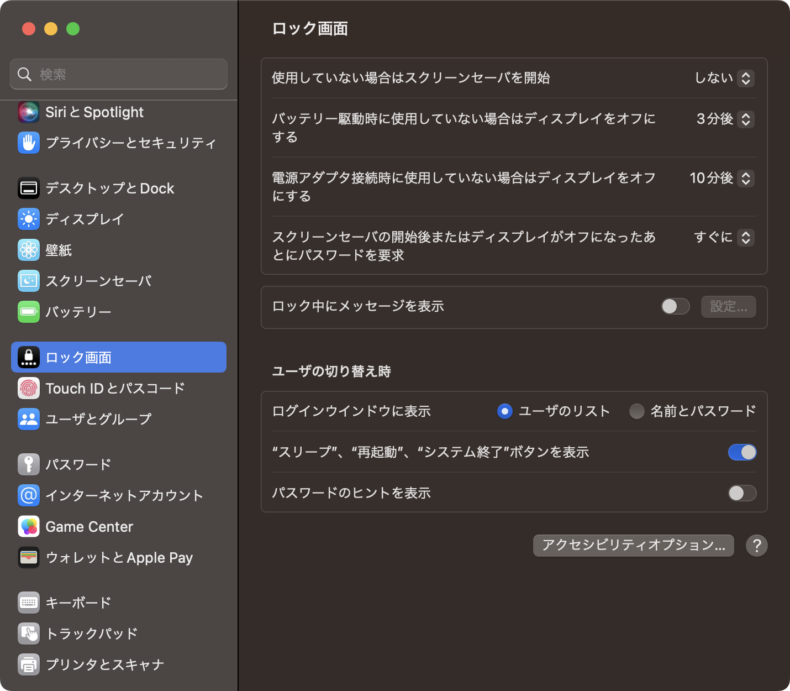
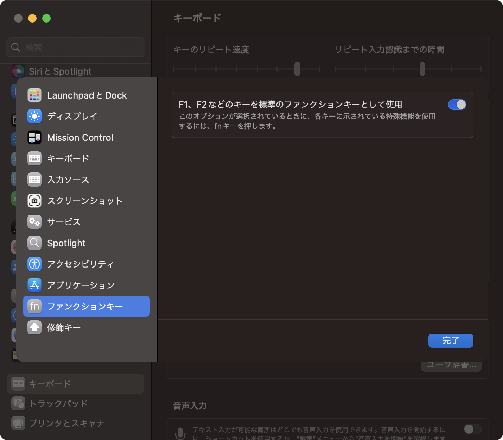
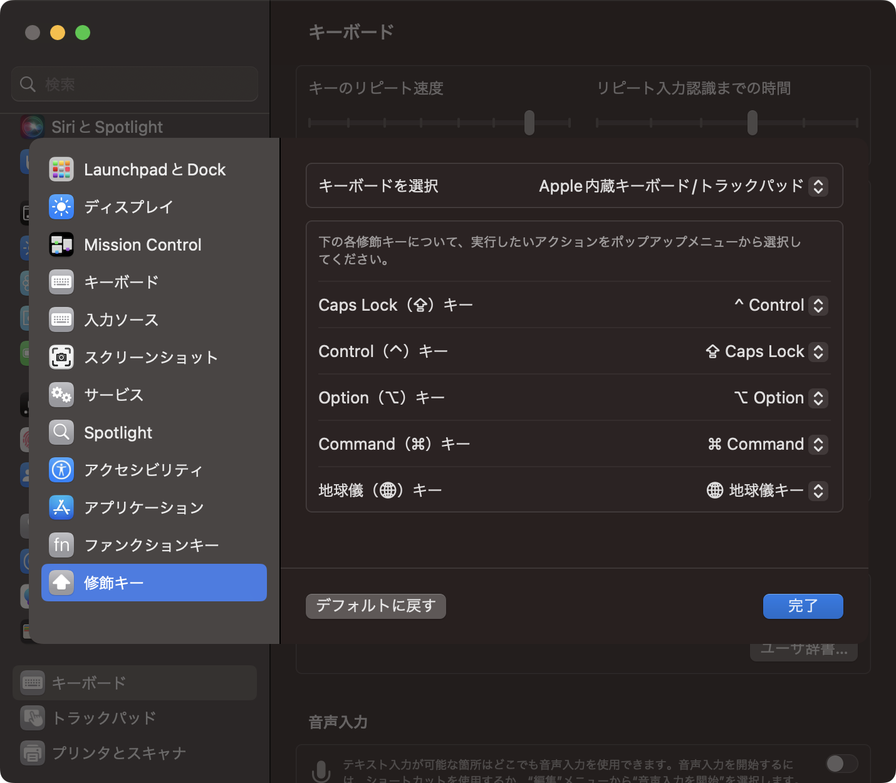
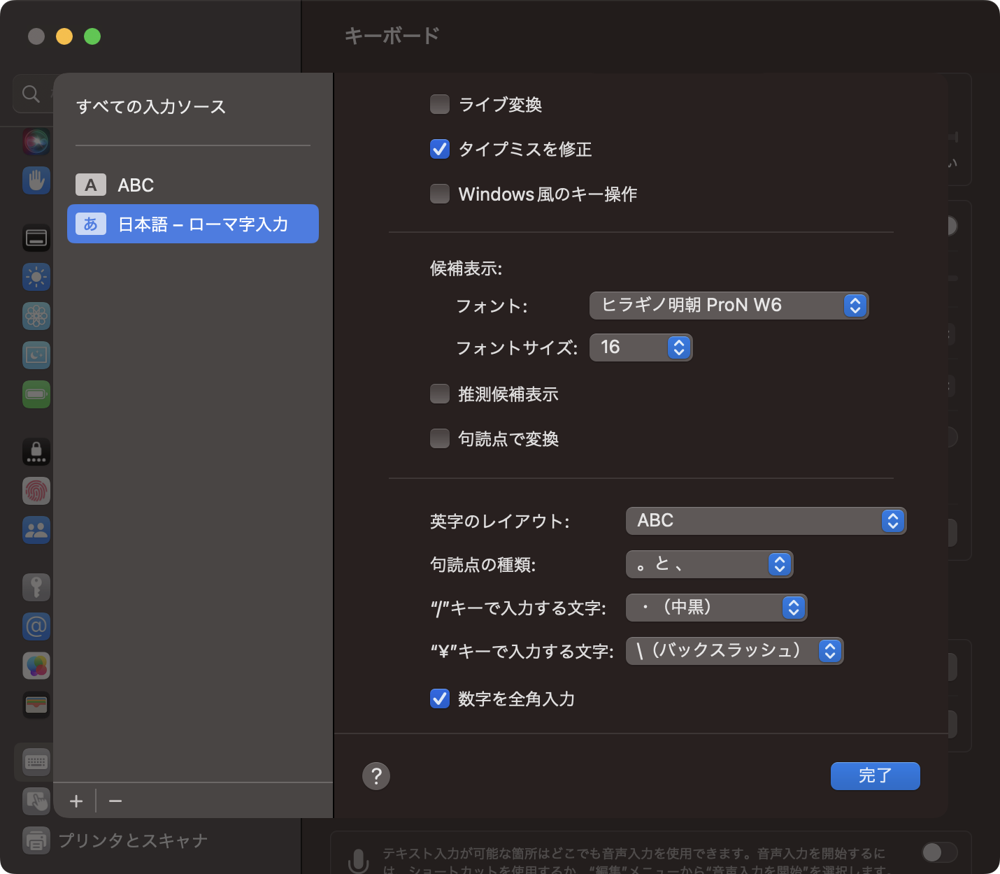
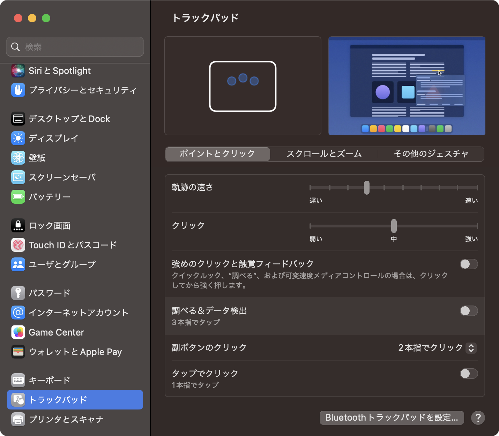

やったことを時系列順にまとめておきます。

## 設定の変更

### デスクトップとDock

初期設定だとただでさえ狭いラップトップの画面を大きく占有したり、最近使ったアプリを並べてたりしてきて目障りなので次のように設定します。



右下にマウスカーソルを持って行ったときにメモが出てきてしまうので無効化します。



### ロック画面

喫茶店などで使うことも考えて、画面をたたんだときに直ちにロックがかかるように設定します。

スリープまでの時間は長ければ長いほど嬉しいんですが、自分がスリープし忘れないことを保証できないためこの時間になっています。



### キーボード

ファンクションキーはファンクションキーとして使う方が多いです。



これは全人類にお勧めしたい設定なんですが、コントロールをAの隣に持ってくると小指が一瞬で届いて便利です。
HHKBでも使われている意外と由緒正しいキー配置で、自作キーボードも全部この配置にしているくらい便利で好きです。



Windowsが親なのでライブ変換にどうしても慣れられません･･･。

本当はWindows風のキー操作にしたいのですが、全角中黒を`Ctrl + O`で半角中黒にしようとするとなぜか半角スラッシュになってしまうのでデフォルトのままにしています。



### トラックパッド

トラックパッドを操作する力が強すぎるのか、押し込んで単語を調べる機能が誤動作しまくるので絶対オフにしています。



### スクリーンショット

まずは『フローティングサムネールを表示』のチェックを外して、撮影のたびに数秒間プレビューして待たされるのを無効化します。


加えてデフォルトでは、ウィンドウのスクリーンショットに大きな余白と影が付きます。SNSに投稿するときは余白ありがオシャレなのかもしれませんが、ブログ等に埋め込むときはレイアウトが崩れて見えるので、コマンドで余白をなくします。

```sh
defaults write com.apple.screencapture disable-shadow -boolean true
killall SystemUIServer
```

余白と影を付けたい場合は1行目を`false`にして再度実行すればOKです。

参考: [Macのスクリーンショットをウィンドウ単位で撮る（余白・影なしの方法も）  |  Macのアンチョコ](https://yama-mac.com/remove_white_space_around_screenshots/)

## 必須ソフトウェアのインストール

### Google Chrome

デフォルトのブラウザに設定するため、Safariを利用するのはここまでです。

### 1Password

ローカルとブラウザへのインストールを両方済ませておきます。

### Google Drive

1Password無しに長大なGoogleのパスワードを打つ気にはなれないので、ここでChromeもまとめてログインします。

## 開発環境のインストール

### Homebrew

インストール用ワンライナーが下記に書いてあるはずなので実行します。

[Homebrew — The Missing Package Manager for macOS (or Linux)](https://brew.sh/)

### Git

Homebrewが導入できたら、とりあえずGitを入れましょう。

```sh
brew install git
```

### Visual Studio Code

GUI環境でのエディタは正直これ以外考えられないです。

日本語対応のプログラミングフォントを入れておくとよいかと思います。僕はずっとCicaがお気に入りです。

[miiton/Cica: プログラミング用日本語等幅フォント Cica(シカ)](https://github.com/miiton/Cica)

使ったことはありませんが、HackGenも良いと聞きます。

[yuru7/HackGen: Hack と源柔ゴシックを合成したプログラミングフォント 白源 (はくげん／HackGen)](https://github.com/yuru7/HackGen)

### Dotfiles

CUIツールの設定ファイルはGitHubで管理しています。
Cloneからのコマンドひとつでいつもの環境が構築されるのでとても便利です。
Gitの初期設定なども自動で終わります。

[kakudo415/dotfiles](https://github.com/kakudo415/dotfiles)

### SSH

詳しくは[研究室PCにCloudflare TunnelsでSSHする](https://kakudo.org/blog/cloudflare-tunnels-into-lab/)をご覧いただくとして、具体的な手順を書きます。

`cloudflared`をインストールして、

```sh
brew install cloudflare/cloudflare/cloudflared
```

`~/.ssh/config`を次のようにします。

```conf
Host <NICKNAME>
    Hostname <HOSTNAME>
    User <USERNAME>
    ProxyCommand /opt/homebrew/bin/cloudflared access ssh --hostname %h
```

### Rust

Rustupが便利すぎる。

[Getting started - Rust Programming Language](https://www.rust-lang.org/learn/get-started)

### Hugo

Goで書かれた静的サイトジェネレータで、このサイトもHugo製です。

```sh
brew install hugo
```

SASS･SCSSを利用するために`dart-sass-embedded`が必要なので、[Releases · sass/dart-sass-embedded](https://github.com/sass/dart-sass-embedded/releases)からダウンロードし、PATHを通します。

## その他のソフトウェアのインストール

### Davinci Resolve

[DaVinci Resolve 18 | Blackmagic Design](https://www.blackmagicdesign.com/products/davinciresolve)

動画編集ソフトです。YouTubeもっとがんばります。

### Discord

[Discord | 会話や交流が楽しめるプラットフォーム](https://discord.com/)

### Microsoft Outlook

大学のメールアドレスで利用するため。App Storeからダウンロードするだけです。

## フォント

VSCodeのところで述べたCicaやHackGenに加えて、通常のフォントだとこのあたりがお気に入りです。

[Inter](https://rsms.me/inter/)

[Noto Sans Japanese](https://fonts.google.com/noto/specimen/Noto+Sans+JP)