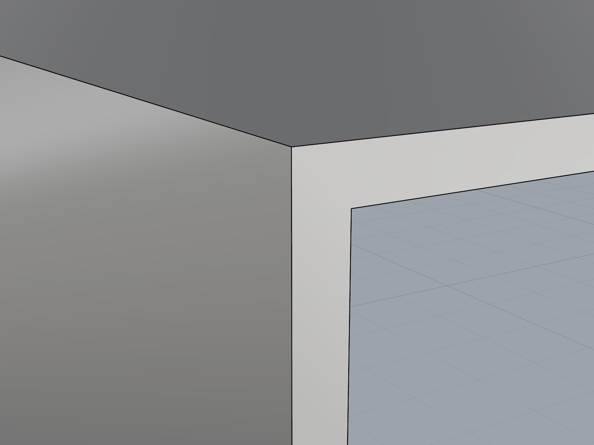
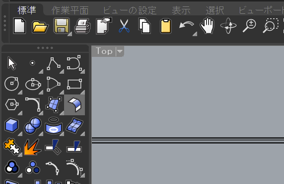
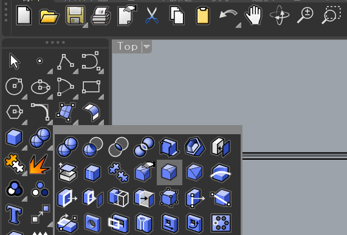
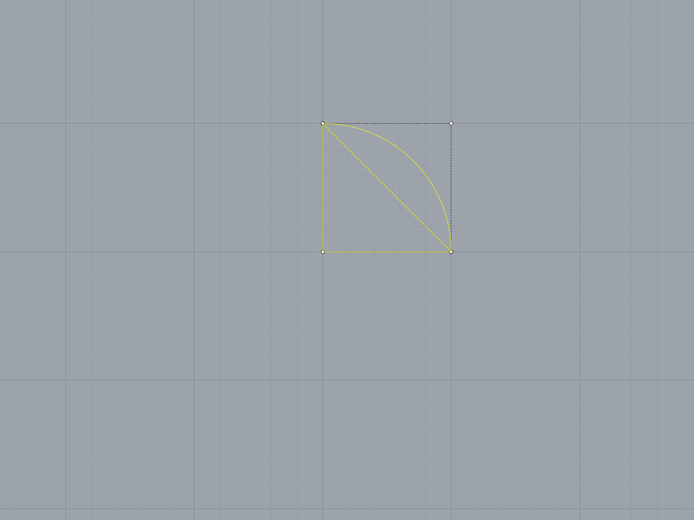
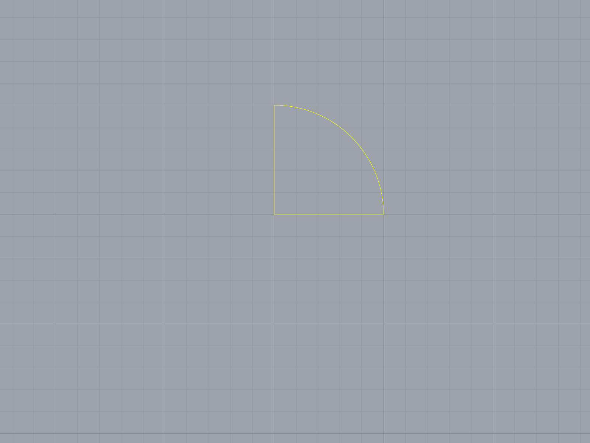

自作キーボードのケースを板金加工で製作するにあたって、Rhinoを利用し始めました。
初めて触るまともなCADということもあり、いろいろ躓いた点があったので、それぞれについて対処法・よかった手法をまとめます。

Grasshopperについては扱いません。

## ソリッドを結合したのに面が繋がらない

ブール演算等でポリサーフェスを作成したとき、同一平面上に位置するサーフェスであっても自動で1枚に結合されないことがあります。

たとえば、直方体2つに対して`BooleanUnion`を適用した以下の例では、左側や正面に見える面が途中で途切れ2枚になっています。
このままでは、大きな径の面取りが正しく作成できなかったりし不便です。

そこでサーフェスの結合、`MergeAllCoplanarFaces`です。
ポリサーフェスを選択し実行することで、同一平面上のサーフェスを結合して綺麗にしてくれます。

## ソリッドでの面取りはどれを使うか

ポリサーフェスの辺を面取りしたいとき、これ見よがしにツールバーに置いてある『サーフェスをフィレット』を選択しそうになります。

しかし、正しくは『エッジをフィレット』です。

## 曲線の繋ぎ方

開いた曲線を繋ぎ合わせて1つの閉じた曲線を作りたいとき、閉じるという操作から`CloseCrv`をしそうになりますが、これでは個々の曲線がそれぞれで閉じてしまいます。

`Join`を適用することで、正しく1つの閉じた曲線にすることができます。

## 参考文献

- [面のマージを覚えよう！ : Rhinocerosの使い方](https://rhino3d.blog.jp/archives/678383.html)
