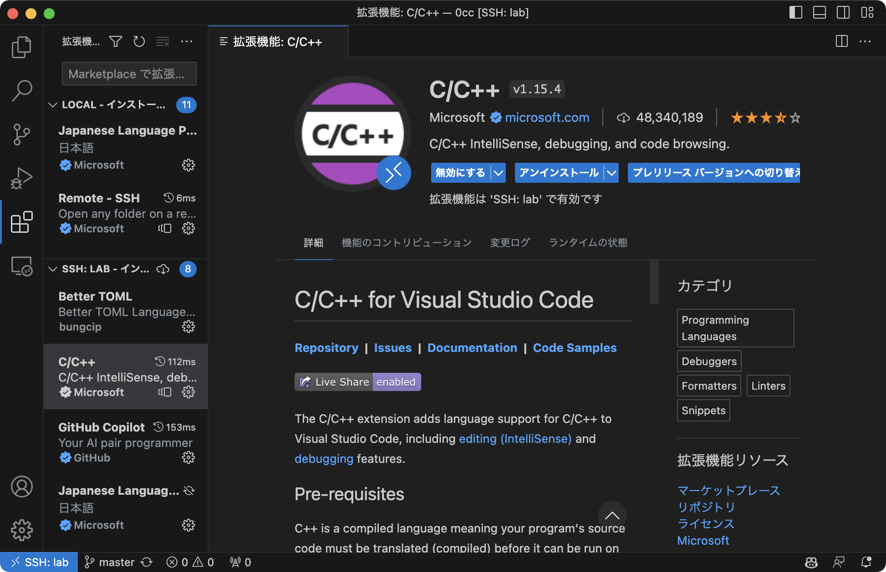

拡張機能**Remote - SSH**をインストールします。

リモートエクスプローラーが左のアクティビティバーに追加されるので、そこからSSH接続先を選択します。
`~/.ssh/config`を参照していると思われるので、未設定の人はこの機会にやっておくといいです。

[研究室PCにCloudflare TunnelsでSSHする](/blog/cloudflare-tunnels-into-lab/)も合わせてどうぞ

SSHでサーバに接続できたら、次にフォルダ（ディレクトリ）を開きます。

拡張機能は、ローカルと接続先で別々に管理されているようです。

ローカルにインストールされている拡張機能をリモート先にも導入するボタンがあるので、そこからまとめてインストールします。

もちろん、個別にインストールすることもできます。

これでローカルのファイルを編集するのと同じようにリモートでも作業できます！便利！

