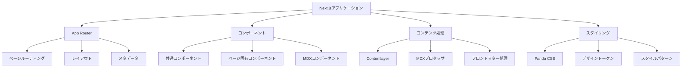
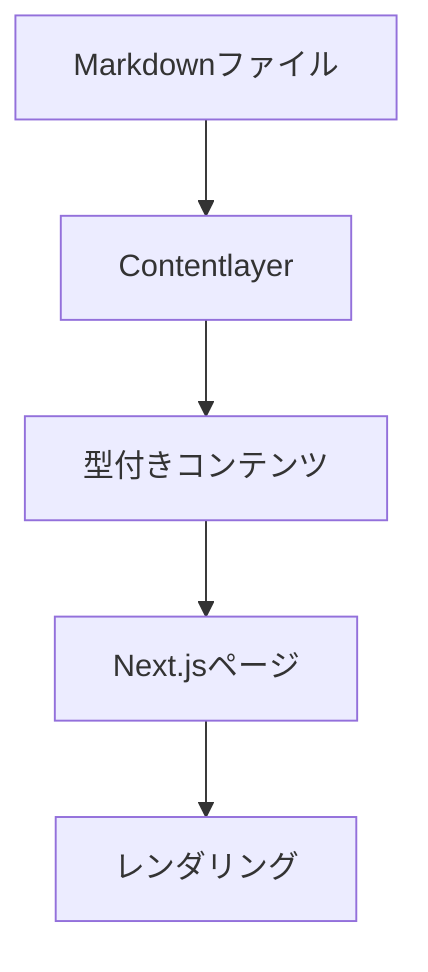
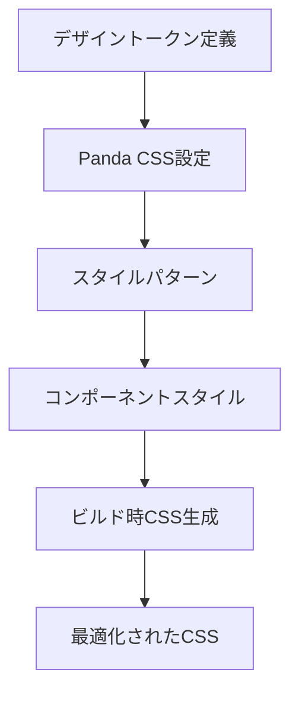
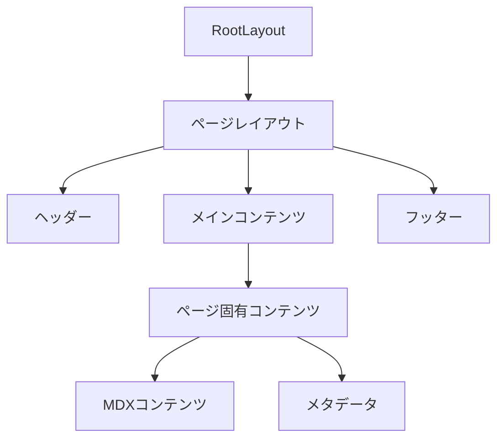
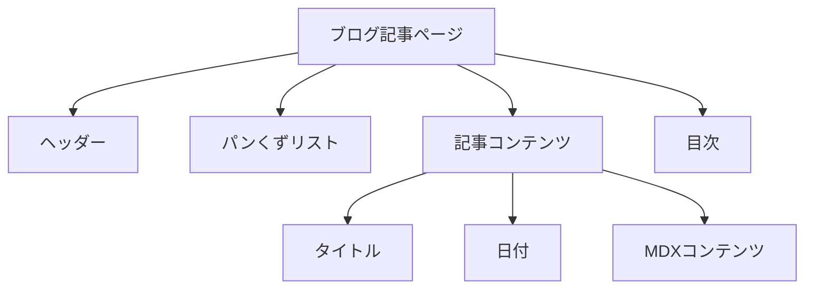

# システムパターン: Hugo から Next.js への移行

## システムアーキテクチャ

## 主要な技術的決定

### 1. Next.js App Router
- **決定**: Next.js v15のApp Routerを採用
- **理由**: 最新のReactパラダイムに準拠し、ファイルベースのルーティングを提供
- **利点**: サーバーコンポーネント、ストリーミング、部分的レンダリングなどの最新機能を活用可能

### 2. Panda CSS
- **決定**: スタイリングにPanda CSSを採用
- **理由**: ゼロランタイムのCSS-in-JSソリューションでパフォーマンスを最適化
- **利点**: 型安全なスタイリング、デザイントークンシステム、ビルド時の最適化

### 3. Contentlayer
- **決定**: MDXコンテンツ処理にContentlayerを採用
- **理由**: 型安全なコンテンツ処理と優れたNext.js統合
- **利点**: コンテンツのバリデーション、型生成、効率的なビルド処理

### 4. 静的サイト生成（SSG）
- **決定**: Next.jsのSSG機能を活用
- **理由**: GitHub Pagesでのホスティングに最適化
- **利点**: 高速なページロード、SEO最適化、サーバーレスデプロイ

## デザインパターン

### コンポーネント設計
- **アトミックデザイン**: UIコンポーネントを原子、分子、有機体、テンプレート、ページの階層で構成
- **コンポジション**: 小さな再利用可能なコンポーネントを組み合わせて複雑なUIを構築
- **プロップドリリングの最小化**: コンテキストやカスタムフックを活用して状態管理を最適化

### データフロー

### スタイリングアーキテクチャ

## コンポーネント関係

### ページ構造

### ブログ記事ページ

## 移行マッピング

| Hugo構造 | Next.js対応 |
|----------|-------------|
| layouts/_default/baseof.html | app/layout.tsx |
| layouts/index.html | app/page.tsx |
| layouts/blog/list.html | app/blog/page.tsx |
| layouts/blog/single.html | app/blog/[slug]/page.tsx |
| layouts/partials/header.html | components/Header.tsx |
| layouts/partials/breadcrumbs.html | components/Breadcrumbs.tsx |
| layouts/partials/table-of-contents.html | components/TableOfContents.tsx |
| assets/sass/ | styled-system/ (Panda CSS) |
| content/ | content/ (Contentlayer) |
| static/ | public/ |
